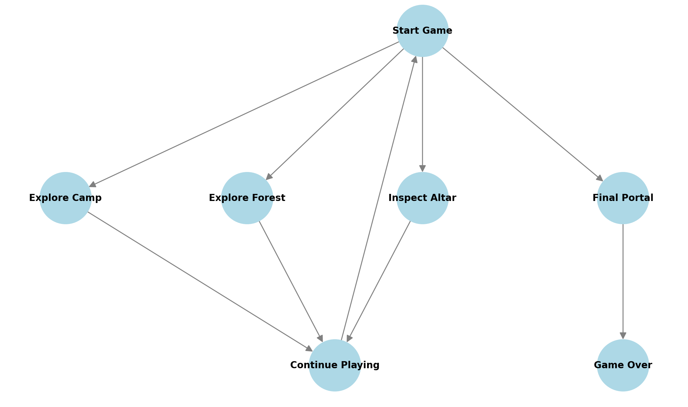

# Проект

Ваша команда должна разработать текстовый квест, используя предоставленный сюжет и структуру игры. Основная цель — создать игру, в которой игрок принимает решения, влияющие на ход событий, а также управляет ресурсами персонажа (зелья, здоровье, энергия, магия).

Ваш проект должен включать:

1. **Логику игры** — реализацию последовательности событий, проверок условий и обновления ресурсов игрока.
2. **Реализацию выбора** — возможность игрока выбирать действия и видеть их последствия.
3. **Сохранение состояния** — структура, позволяющая игроку возвращаться к предыдущим этапам игры.
4. **Проверку ошибок** — обработку некорректного ввода.
5. **Документацию** — README с описанием проекта, инструкциями по запуску и объяснением ключевых механик игры.

Не забудьте проверить работоспособность вашего кода и предусмотреть различные сценарии поведения игрока!

### **Сюжет**

Игрок оказывается в лесу, где старейшина деревни просит помощи в восстановлении разрушенного алтаря Рун Судьбы. Каждое решение влияет на магический баланс мира, а также на выживание персонажа. *У игрока есть четыре ресурса*: __зелья, здоровье, энергия и магия__. Ошибки могут привести к потере ресурсов или даже провалу миссии.

Ваши задачи: активировать магическую руну, чтобы открыть главный портал и разгадать тайну, которую скрывают лес и его обитатели. 

Сможете ли вы пройти испытания и открыть портал или ваша магическая сила иссякнет прежде, чем вы достигнете цели?

#### **Ресурсы**

- Зелья: 0
- Энергия: 5
- Здоровье: 7
- Магия: 3

**Технические рекомендации по реализации**

- Опишите всю логику внутри класса `Game`. Декомпозируйте логику по методам.
- Определите переменные игры внутри класса, чтобы каждый метод мог напрямую работать с ними. Это позволит менять их состояние из методов. Пример: 

  ```java
  public class Game {
  
    private static int health = 7; // Храним здоровье
  
    private static void upHealth() {
       health += 1; // в методах можем получить доступ к переменной health
    }
  } 
  ```

  Определите переменные для следующих характеристик:
  - здоровье (`health`),
  - энергия (`energy`),
  - магия (`magic`),
  - зелья (`potions`),
  - количество найденных рун (`runes`).
- Реализуйте методы: 
  - `usePoison`: использование зелий (*+5 к здоровью)*;
  - `printStatus`: отображение текущего состояния игрока.
- Обработайте ошибки (например, попытку использовать зелья, если их нет).
- Напишите метод `checkGameOver`, в котором будет содержаться логика проверки уровня здоровья и энергии игрока. При истощении ресурса «здоровье» игрок использует имеющееся у него зелье с помощью метода `usePoison`. Если у игрока нет зелья, то он погибает, и игра завершается. Если у игрока закончилась энергия, то игра тоже завершается.
- Для обработки пользовательского ввода используйте `Scanner`.

### **1. Исследование лагеря**

Герой начинает с небольшого лагеря, оставленного прежними исследователями. Здесь он находит карту леса, магический кристалл и несколько зелий.

#### **Доступные действия**

1. Взять карту и изучить маршрут (*+2 к энергии*, откроются подсказки для следующих шагов).

   **Подсказки, которые выведет карта:** 
   - «На карте отмечены три возможных пути к первым рунам: один через густой лес, другой — по старой заброшенной дороге, третий — скрытая тропа, найденная рядом с лагерем».
   - «Густой лес полон ловушек, но в нём есть полезные ресурсы. Старый путь безопасен, но долго обходить. Скрытая тропа — наиболее безопасна, но её сложно найти без магии».
   - «Вижу, что на карте рядом с вами есть магический источник. Пройди его, если хочешь увеличить свои силы».
2. Использовать магический кристалл, чтобы просканировать ближайшую территорию (герой находит скрытую тропу, открывая альтернативный путь к первой руне).
3. Осмотреть лагерь и искать зелья для увеличения здоровья (*находит зелье,* но тратит время, *уменьшая энергию на 1*).

После завершения этого этапа игрок может вернуться к лагерю в любой момент, чтобы восстановить здоровье (использовать найденные зелья, одно использованное зелье *+5 к здоровью*) или повторно изучить карту.

**Технические рекомендации по реализации**

1. Реализуйте действия на первом этапе по сюжету**:** реализуйте метод `exploreCamp` в классе `Game` с выбором действия для первого этапа. В зависимости от выбора у игрока меняется количество ресурсов.
2. Предусмотрите, чтобы при повторном заходе в лагерь набор действий отличался. Вынесите повторяющие части кода с первого и последующих заходов в лагерь в отдельный метод. 

### **2. Путешествие через лес**

Герой углубляется в лес. Каждое решение здесь влияет на его ресурсы и дальнейшие развилки.

1. Следовать основным путём через густой лес.
   - **Успех:** 
     - Чтобы пройти через густой лес, герой должен иметь не менее **3** **здоровья** и **2 энергии**.
       - Сообщение: «Вы уверенно идёте по основному пути, избегая некоторых ловушек, но несколько всё-таки срабатывают. К счастью, вы не получили серьёзных травм, и ваш путь продолжается».
         - После прохождения через густой лес герой *теряет 3 здоровья*, но находит магический амулет и получает *+2 к энергии*.
   - **Неудача:** 
     - Если у героя недостаточно ресурсов, он не может пройти через густой лес и попадает в ловушки, но, выбираясь из них, *теряет 5 здоровья* и *2* *энергии*:
       - Сообщение: «Вы не успеваете избежать всех ловушек, и несколько из них активируются. Вам удаётся выбраться, но ваши силы на исходе». 
2. Вызвать магического фамильяра для разведки пути.
   - **Успех:** 
     - Чтобы вызвать магического фамильяра, герой должен иметь не менее **2** **магии**.
       - Сообщение: «Вы вызываете своего фамильяра, и он, используя свои способности, находит безопасный путь через лес, избегая большинства опасностей».
         - После вызова магического фамильяра игрок *тратит 2 магии* и получает *3 здоровья*.
   - **Неудача:** 
     - Из-за нехватки ресурсов магия фамильяра не срабатывает, и игрок *теряет 2 магии* и *2 энергии*.
       - Сообщение: «Магия фамильяра не срабатывает должным образом, и вы теряете силы, не получив нужной помощи».
3. Пойти по скрытой тропе, обнаруженной в лагере (пункт появляется, только если скрытая тропа обнаружена при обследовании лагеря).
   - **Успех:**
     - Чтобы пойти по скрытой тропе, герой должен иметь не менее **2 энергии**.
       - Сообщение: «Вы выбрали скрытую тропу, и, благодаря подсказкам на карте, смогли избежать ловушек и не потерять много сил».
         - После прохождения по скрытой тропе герой находит кратчайший путь и получает *+2 к энергии*, избегая потерь в здоровье.
   - **Неудача:** 
     - Из-за недостатка ресурсов игрок попадает в магические ловушки, теряет *3 энергии* и *1 здоровье*.
       - Сообщение: «Скрытая тропа оказывается полна неожиданных магических ловушек. Вы теряете драгоценную энергию, пытаясь от них защититься».

**Технические рекомендации по реализации**

- В классе `Game` реализуйте метод `exploreForest`, в котором будут описаны сценарии с выбором действия. Каждый сценарий должен проверять ресурсы игрока по описанному сюжету и обновлять их согласно результатам действия.

### **3. Найти руну**

После путешествия через лес герой находит древний алтарь, охраняющий первую руну. **Если герой не исследовал лес, то необходимо вывести подсказку о том, что нужно сходить туда, и вернуть на экран выбора действий.**

**1.** Исследовать символы на алтаре.

- **Успех:** 
  - Чтобы исследовать символы на алтаре, герой должен иметь не менее **3** **энергии** и **1 магию**.
    - Сообщение: «Вы внимательно изучаете символы и, приложив усилия, расшифровываете их значение. Это открывает секретный механизм и позволяет вам получить первую руну без лишних трудностей».
      - После изучения символов герой получает +*2 к энергии* и *+1 к магии*.
- **Неудача:** 
  - Так как у героя не хватило ресурсов, он не смог расшифровать символы и *потерял 3 здоровья:*
    - Сообщение: «Ваши попытки расшифровать символы не приводят к успеху. Алтарь выбрасывает магический импульс, и вы теряете несколько сил».

**2.** Использовать магический кристалл, найденный ранее.

- **Успех:** 
  - Чтобы использовать магический кристалл, герой должен иметь не менее **2** **энергии**.
    - Сообщение: «Вы активируете кристалл, и его свет облучает алтарь. Он указывает путь к руне, и вы успеваете пройти к ней без потерь».
      - После использования кристалла игрок восстанавливает *+3 здоровья*, *теряя 2 энергии*.
- **Неудача:** 
  - У героя не хватает энергии для использования магического кристалла и после неудачи он *теряет 1 энергию* и *1 здоровье.*
    - Сообщение: «Когда вы активировали кристалл, его энергия не совпала с энергией алтаря, что привело к небольшому откату магии. Портал остаётся заблокированным».

**3.** Попытаться разрушить алтарь.

- **Успех:** 
  - Чтобы разрушить алтарь, герой должен иметь хотя бы **3 здоровья** и **3** **магии**:
    - Сообщение: «Вы решаете разрушить алтарь и, используя свою магическую мощь, разрушаете его. Это даёт вам доступ к первой руне».
      - После разрушения алтаря герой *теряет 5 здоровья*, но *получает руну*.
- **Неудача:** 
  - Из-за нехватки ресурсов алтарь не повреждается, и герой *теряет 3* *энергии.*
    - Сообщение: «Ваши попытки разрушить алтарь не увенчались успехом. Алтарь выбрасывает мощный магический импульс, отбрасывая вас назад».

**Технические рекомендации по реализации**

- В классе `Game` реализуйте метод `inspectAltar`, в котором будут описаны сценарии с выбором действия. Каждый сценарий должен проверять ресурсы героя по описанному сюжету и обновлять их согласно результатам действия.

### **4. Финальный портал**

__Найдя руну__, герой возвращается к порталу. Портал активируется, но лес обрушивает на героя последнее испытание.

- 1. Использовать все оставшиеся ресурсы, чтобы активировать портал.
  - **Если герой имеет руну, а также не менее 5 здоровья, не менее 3 энергии и не менее 1 магии для успешного активации портала:** «Вы открываете портал и проходите через него, разгадка раскрыта!»
    - Герой *успешно открывает портал* и *завершает игру*.
  - **Если ресурсов не хватает:** «Портал не активируется, вы можете завершить задание, пополнив ресурсы».
    - Герою предлагается пойти в предыдущие локации для пополнения ресурсов, чтобы успешно завершить игру. 

**Технические рекомендации по реализации**

- В классе `Game` создайте метод `openFinalPortal` и реализуйте в нём проверку условий завершения игры:
  - Если ресурсов недостаточно и герой не пополнил их, то он может сделать это, вернувшись к предыдущим этапам.
  - Если ресурсов достаточно, согласно сценарию, герой успешно проходит квест.
- В классе `Game` напишите метод `` `runGame` ``, в котором будет реализован цикл с выбором этапа (лагерь, лес, алтарь, финальный портал). 
- Перед выбором этапа герою выводится информация о его статусе (количестве каждого ресурса). Смотрите метод `printStatus`.
- После выбора этапа запускается метод, соответствующий ему. 
- Вызывайте метод `runGame` в методе `main`.

→ *Не забудьте прописать проверку на корректный пользовательский ввод.*

### Возможные переходы между локациями



## Рекомендации по работе в команде

Проект делится на три основные части. Каждая задача включает несколько задач.

1. **Логика игрока и базовые механики**: управление состоянием игрока, реализация функционала использования зелий и отображения статуса.
2. **Игровые сценарии и взаимодействие с окружением**: создание основных игровых событий (лагерь, лес, алтарь, финальный портал).
3. **Интеграция и проверка взаимодействия модулей**: финальная сборка проекта, проверка работоспособности кода.

C технической точки зрения реализация может быть следующей: 

1. Взаимодействовать с пользователем нужно через стандартный ввод и вывод. Пользователю выводят описание возможных ходов на каждом этапе игры. Каждый ход пронумерован. Пользователь вводит число, соответствующее номеру хода, после чего игра переходит к следующему этапу.
2. В методе `runGame` в цикле пользователь выбирает локацию. После этого запускается сценарий, соответствующий этой локации. Каждый сценарий находится в отдельном методе.
3. Сценарий подразумевает несколько ответвлений. Он спрашивает пользователя о дальнейших шагах и обрабатывает его выбор. После завершения сценария управление возвращается в метод `runGame`, где пользователь может выбрать другую локацию.

Более подробное описание можно найти ниже. 
 

**Распределите задачи между участниками**

##### **Участник 1 — разработчик логики игрока**

1. Реализует класс `Game`:
   - методы `usePoison`, `printStatus`;
   - определяет переменные для управления состоянием игрока (здоровье, энергия, магия, зелья, инвентарь, количество рун);
   - обработка ошибок (например, попытка использовать зелья при их отсутствии);
   - реализует логику событий в методе `checkGameOver` класса `Game`;
   - реализует один сценарий `exploreCamp`.

##### **Участник 2 — разработчик игровых механик**

1. Реализует логику сценариев:
   - методы `exploreForest`, `inspectAlter`, `searchTemple` в классе `Game`;
   - обработка пользовательского ввода в каждом сценарии.
2. Документирует класс `Game`:
   - описание сценариев и их взаимосвязей.

##### **Участник 3 — разработчик событий финального портала и основного цикла для сценария**

1. Реализует сценарии методов `openFinalPortal` и `runGame`, обрабатывает пользовательский ввод.
2. Реализует финальные проверки: 
   - условия завершения игры;
   - логика возврата в лагерь для подготовки.

##### **Совместные задачи**

- Интегрировать все модули в единую программу.
- Проверить работоспособность каждой функции.
- Написать документацию для проекта.

---

## **Рекомендации по работе с проектом и публикации в Git**

Чтобы командная работа над проектом в Git была эффективной, рекомендуем следовать принципам ниже.

### **1. Обсуждать с командой кейс** 

- Обсудить структуру игры, включая игровые сценарии, события и взаимодействия между классами Player и Game.
- Проанализировать связи между задачами, определить зависимости и приоритеты.
- Проанализировать требования к функционалу каждой задачи. Например: 
  - Что должно содержать управление состоянием игрока (здоровье, энергия, магия, зелья, инвентарь)?
  - Как реализовать игровые события и сценарии?

### **2. Планировать задачи и распределять роли**

1. **Создать Issues в GitLab.**
   - Каждый участник фиксирует свои задачи в отдельных Issue. Например: 
     - *«Создать класс Player»*, *«Реализовать сценарий лагеря»*.
   - Включайте чек-листы для отслеживания выполнения подзадач.

   **Пример Issue для класса Player:**

   ```
   - [ ] Создать атрибуты игрока (health, energy, magic, potions)
   - [ ] Реализовать метод usePoison
   - [ ] Реализовать метод printStatus
   - [ ] Добавить документацию
   ```
2. **Распределить роли.**
   - **Участник 1.** Общий функционал игры (инициализация, счётчики), использование зелий, помощь участнику 2 в разработке сценариев.
   - **Участник 2.** Разработка игровых событий (например, `explore_camp`, `inspect_altar` и т. д.) и сценариев, включая пользовательский ввод.
   - **Участник 3.** Финальная логика завершения игры и события алтаря.

### 3. Оценивать время выполнения задач

Задачи проекта нужно оценивать в **часах**, чтобы развить навыки планирования времени. Это более прямой способ оценить затраты, который позволяет учитывать опыт и возможности каждого члена команды.

Каждый участник команды фиксирует время для своей задачи в поле **«Оценка времени»** в Issue. Это поможет:

- учитывать личную загрузку
- анализировать эффективность работы в дальнейшем

## Оценка проекта

Оценка проекта осуществляется на основе реализованной функциональности
- Пользователь может посетить все указанные локации (0-3 балла)
- Пользователь может осуществлять указанные действия в каждой локации (0-4 балла)
- Пользователь может накапливать, тратить и отслеживать количество всех указанных типов ресурсов (0-3 балла)

Баллы выставляются исходя из [общих критериев](https://git.culab.ru/bsc-development-basics-2nd-semester/dev-basics-2025-longreads/-/blob/main/common/projects-assessment/README.md)